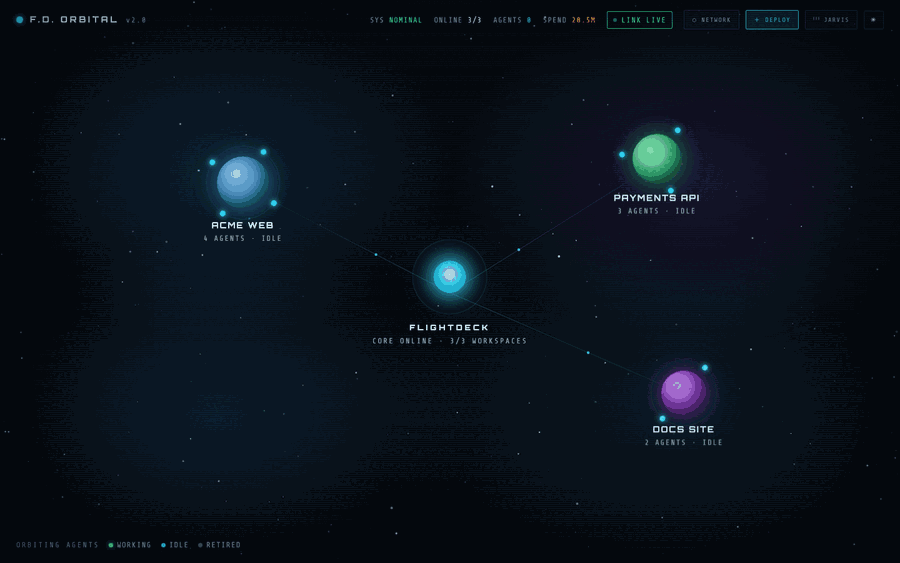
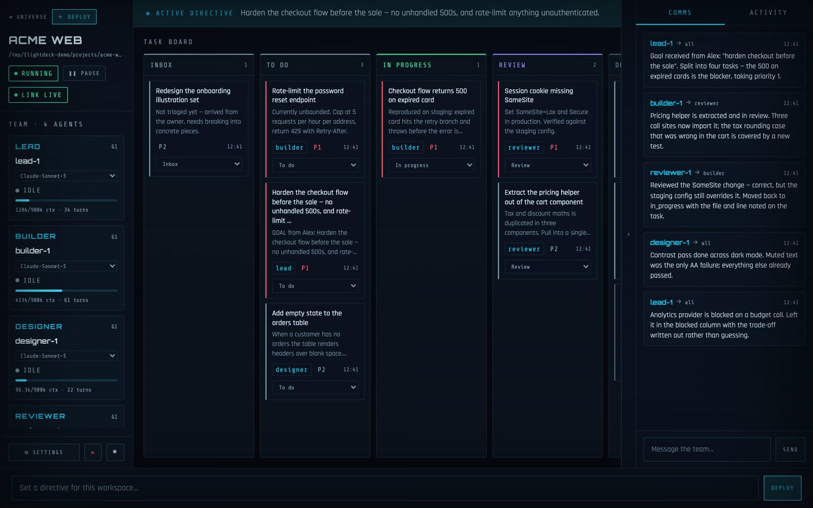
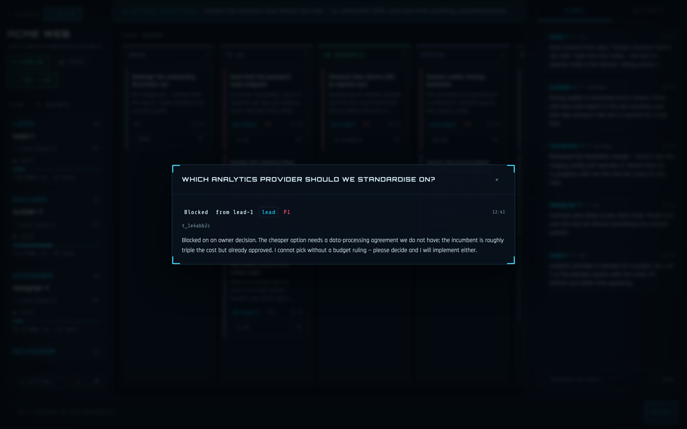

# Flightdeck

A local orchestrator + dashboard for running **teams of autonomous Claude agents** across your projects. Each project you add gets role-based agents — lead, builder, designer, reviewer, grunt — that are separate headless `claude` sessions coordinating through a shared task board and message bus. You set high-level goals from the dashboard; the lead decomposes them, the team executes, and you watch every message, tool call, and handoff live.

Everything runs on your own machine. There is no hosted service, no account to create, and no telemetry — the dashboard is a local web page talking to a local process, and all state lives in a SQLite file you can delete.



<sub>Every project you add becomes a world, and the dots orbiting it are its agents — green while working, blue when idle. Click a world to drop into its board.</sub>

---

## What it looks like

**The board.** Each workspace has a task board, its team down the left with live context and turn counts, and the bus on the right. You set a directive at the bottom; the lead decomposes it into tasks and the team picks them up.



**Blocked work comes to you.** When an agent hits something only you can decide, it leaves the task in `blocked` and writes down what it needs. Click any task to read the whole thing — no digging through logs.



---

## Quick start

**Requirements**

| | |
|---|---|
| **Node.js** | 20 or newer — [nodejs.org](https://nodejs.org) |
| **Claude Code CLI** | `npm install -g @anthropic-ai/claude-code`, then run `claude` once to sign in |
| **A Claude subscription** | Pro or Max. Agent turns run through your signed-in CLI, so they use your existing plan rather than a separate API bill. |
| **OS** | macOS, Linux, or Windows |

**Install and run**

```bash
git clone <this-repo> flightdeck
cd flightdeck
npm install
npm start
```

Then open **http://localhost:4400**.

On first run Flightdeck creates your own `flightdeck.config.json` from `flightdeck.config.example.json` and walks you through a two-step setup screen: connect the Claude CLI, then pick your first project folder. Agents are created automatically and start work as soon as you post a goal.

> **Prefer a managed launcher?** `bin/server.sh` (macOS/Linux) and `bin\server.cmd` (Windows) install dependencies if needed, start the server **detached** so it survives closing the terminal, wait for the port, and open the dashboard. See [Running as a background service](#running-as-a-background-service).

---

## How it works

```
┌─────────────────────────── Flightdeck (this repo) ───────────────────────────┐
│                                                                                   │
│  Dashboard (localhost:4400) ── Fastify REST + WebSocket ──┐                       │
│                                                           │                       │
│  Supervisor loop ── every tick, gives idle agents a turn  │                       │
│      │               when they have unread messages or    │                       │
│      │               assigned tasks                       │                       │
│      ▼                                                    ▼                       │
│  claude -p --resume <session> ◄──────────────► SQLite (tasks, messages,           │
│      │  headless session per agent,            events, turns, agents)             │
│      │  runs in the project's directory              ▲                            │
│      └── flightdeck-bus MCP server ─────────────────────┘                            │
│          (bus_post_message, bus_create_task, bus_update_task, …)                  │
└───────────────────────────────────────────────────────────────────────────────────┘
```

- **Turns, not daemons**: an agent's "session" is a persistent claude conversation; the supervisor wakes it with `--resume` when the **board** has work for it — a todo assigned to its role, its own unfinished in-progress task, the reviewer's review column, or the lead's inbox and newly-blocked queues. Idle teams cost nothing, and an empty board really is silent.
- **Messages never wake anyone**: bus mail is context, not a trigger. It is delivered alongside the next turn the board justifies. Waking on unread mail made chatter self-sustaining — every turn produces mail, which woke someone, who produced more — so an idle team never settled. To ask something of another role, **create a task for them**; that is what wakes them, and it is visible to you on the board.
- **The bus is the only channel**: agents talk via MCP tools that write to SQLite, so every inter-agent message is durable, inspectable, and visible in the dashboard's Comms tab. You can speak on the bus too.
- **Session succession**: when a session's context estimate nears its model's window, the supervisor has it write a handoff brief to the bus, retires it, and spins up the next generation (`builder-2`), which inherits the brief as its first unread message. Thresholds are model-aware: 900k for the 1M-window models (fable, opus, sonnet), 180k for haiku (200k window). Set `contextLimit` on a workspace to override.
- **Subscription auth**: sessions run through your logged-in `claude` CLI — no separate API bill, no API key to paste anywhere.

### Does it work with OpenAI?

**No — Claude only, today.** Flightdeck does not call a model API directly; it drives the **Claude Code CLI** as a child process and depends on CLI-specific features (`--append-system-prompt`, MCP server injection for the bus, `--permission-mode`, `--allowedTools`, and stream-json turn telemetry). There is no OpenAI equivalent to point it at, so supporting another provider means writing a second orchestrator backend, not flipping a setting.

The binary Flightdeck spawns *is* configurable via `cliPath`, so a CLI-compatible shim can be substituted — but nothing of that kind ships here, and none is endorsed. If you build one, it must accept the same flags and emit the same stream-json events.

---

## Setting up your first project

From the dashboard, click **＋ Deploy** (or **Choose a project folder** on the setup screen) and give it:

- **Name** — anything; the workspace id is derived from it.
- **Path** — a folder on this machine. **Browse** opens a native folder chooser on macOS and an inline folder browser everywhere else.
- **Roles & models** — which agents to create and which model each runs. `lead`, `builder`, and `reviewer` are selected by default.

The **lead** receives your goals and decomposes them, so every team should have one. Type a goal into the command bar at the bottom of the workspace view and the team starts.

> ⚠️ **Agents write to the folders you add.** They run with file-write and shell access inside those directories (see [Permissions & safety](#permissions--safety)). Only add projects you're willing to let them change, and keep those projects in version control so you can review and revert.

---

## Configure

Your settings live in `flightdeck.config.json` in the repo root. It is **gitignored** — it holds absolute paths to your own projects — and is created for you on first run from `flightdeck.config.example.json`. Most of it is editable from the dashboard's Settings panel; edit the file directly for the rest.

| Key | Meaning |
|---|---|
| `ownerName` | What agents call you in their system prompts and on goals you post. Leave blank and they say "the operator". |
| `port` | Dashboard port (default `4400`). |
| `dbPath` | SQLite file, relative to the repo root. |
| `maxConcurrentTurns` | Global cap on simultaneous claude sessions. Raise it for more parallelism, lower it to be gentler on your rate limits. |
| `tickSeconds` | Supervisor scheduling interval. |
| `cliPath` | Full path to the Claude CLI. Omit to auto-detect. Can also be set per-shell with `FLIGHTDECK_CLI` — see [Environment](#environment). |
| `models[]` | Optional. The exact models offered in every dropdown, and the allow-list the API validates against. |
| `workspaces[]` | Your projects: `id`, `name`, `path`, `roles[]` (each `role`, `model`, `prompt`), optional `contextLimit`, `allowedTools`, `extraAllowedTools`. |

### Models

Omit `models` and you get the shipped catalog: the four floating aliases (`sonnet`, `fable`, `opus`, `haiku`), each labelled with the version it currently resolves to (`Claude-Opus-5`, `Claude-Haiku-4.5`, …). To run a frozen version instead of a floating alias, list its exact ID. An empty array — or one with no usable entries — falls back to that same catalog rather than leaving nothing selectable.

Each entry is either the bare `--model` value or `{ "id", "label" }`; the label is what dropdowns display, so you can pin a version and still read it at a glance. IDs are passed to the CLI verbatim and are **not** checked against a list of real models — you get exactly what you configure.

```json
"models": [
  { "id": "claude-opus-4-5-20251101", "label": "opus 4.5 (pinned)" },
  "claude-haiku-4-5-20251001",
  { "id": "sonnet", "label": "sonnet — latest" }
]
```

An agent already running a model you later remove from the catalog keeps it — its dropdown still lists and selects that value, so editing the catalog never silently re-points a live agent.

Changes to `models`, `port`, and `cliPath` take effect on restart. Workspaces and roles apply immediately.

### Environment

Two environment variables are read at startup. Neither is required — both exist for cases the config file cannot cover.

| Variable | Effect |
|---|---|
| `FLIGHTDECK_CLI` | Full path to the Claude CLI, same meaning as `cliPath`. Use it when the path belongs to a shell or a machine rather than to your checked-in settings. |
| `ANTHROPIC_API_KEY` | If set, turns bill to that API key instead of your Claude subscription. Flightdeck never sets or stores it; it only reports which mode is in effect, on the dashboard's setup screen. |

`cliPath` and `FLIGHTDECK_CLI` are the **escape hatch** for a non-standard install: whichever is set is used verbatim and never second-guessed, so auto-detection cannot override it. `cliPath` wins if both are set. This is what to reach for when detection fails — most often on Windows (see [Troubleshooting](#troubleshooting)).

```bash
FLIGHTDECK_CLI=/opt/claude/bin/claude npm start
```

The `preflight` block in [`docs/api-contract.md`](docs/api-contract.md) reports which one was used: `source` is `config` for `cliPath`, `env` for `FLIGHTDECK_CLI`.

---

## Permissions & safety

Sessions run with `--permission-mode acceptEdits` plus an explicit `allowedTools` list. **The default list includes `Bash`**, so agents can run arbitrary commands inside the project directories you add. Tools not on the list are auto-denied in headless mode.

To tighten a workspace, set `allowedTools` (replaces the default list entirely) or `extraAllowedTools` (adds to it) in `flightdeck.config.json`:

```json
"allowedTools": ["Read", "Edit", "Write", "Glob", "Grep", "Bash(npm *)", "Bash(git *)"]
```

Practical advice: keep every project you add under version control, start with a project you don't mind breaking, and read the Activity tab — every tool call an agent makes is logged there.

The server binds to `127.0.0.1` only, so the dashboard is not reachable from your network.

---

## Running as a background service

The server managers install dependencies if needed, start the server detached, wait until the port answers, and open the dashboard.

**macOS / Linux**

```bash
./bin/server.sh            # restart (default)
./bin/server.sh start      # start, or just open the tab if already up
./bin/server.sh stop       # graceful shutdown (SIGINT -> agents exit cleanly)
./bin/server.sh status
./bin/server.sh logs       # tail /tmp/flightdeck.log
```

**Windows** — Command Prompt

```bat
bin\server.cmd
bin\server.cmd start
bin\server.cmd stop
bin\server.cmd status
bin\server.cmd logs
```

Both are safe to run from any directory and read the port from your config. There are npm aliases too (`npm run server:restart`, `server:start`, `server:stop`, `server:status`) — those shell out to the `.sh`, so on Windows call `bin\server.cmd` directly.

Optional shell alias (add to `~/.zshrc` or `~/.bashrc`):

```bash
alias mc='~/path/to/flightdeck/bin/server.sh'
```

> **Stopping the server stops the whole agent fleet** — they're its child processes. On macOS/Linux they get SIGINT and shut down cleanly; Windows has no console SIGINT, so `server.cmd stop` tree-kills them instead.

> **After a restart, hard-refresh any dashboard tab you already had open** (Cmd+Shift+R / Ctrl+F5). The page never re-fetches `app.js`, so an old tab keeps running stale code.

---

## Troubleshooting

**"Claude CLI not found" on the setup screen, or agents never leave idle.**
Install it with `npm install -g @anthropic-ai/claude-code` and run `claude` once to sign in. Then press **Check again** — no restart needed. If it's installed somewhere unusual, set `cliPath` in `flightdeck.config.json` to its full path and restart.

**Windows: the server starts but agents fail immediately.**
Flightdeck avoids spawning the npm-global `claude.cmd` directly (Node refuses to exec `.cmd` files without a shell) by preferring the native-installer binary or running the package's `cli.js` under Node. If detection fails, set `cliPath` to either `%USERPROFILE%\.local\bin\claude.exe` or the full path of `cli.js` inside your global `@anthropic-ai/claude-code` install.

**Port 4400 is already in use.** Change `port` in `flightdeck.config.json` and restart.

**A workspace warns "path does not exist" at startup.** The folder was moved or deleted. Fix the path in the dashboard's Settings panel, or remove the workspace.

**I want a clean slate.** Stop the server and delete `data/flightdeck.db`. That wipes every team, task, message, and transcript. Your config and your projects are untouched.

**Nothing is happening and no errors appear.** Check the workspace isn't paused (the header toggle), and confirm the lead role exists — goals are routed to it.

---

## Layout

- `src/index.ts` — entrypoint: first-run config bootstrap, preflight, DB, supervisor + server
- `src/preflight.ts` — Node/CLI environment checks and cross-platform CLI resolution
- `src/config.ts` — `flightdeck.config.json` ownership, model catalog, role defaults
- `src/db.ts` — SQLite (WAL) schema + `Store` helpers, shared by all processes
- `src/bus/server.ts` — the flightdeck-bus MCP server attached to every agent session
- `src/orchestrator/session.ts` — spawns one headless claude turn, parses stream-json telemetry
- `src/orchestrator/supervisor.ts` — scheduling, goal dispatch, context-limit succession
- `src/server/index.ts` — REST + WebSocket API (contract in `docs/api-contract.md`)
- `dashboard/` — vanilla-JS SPA served at `/`
- `data/flightdeck.db` — all state (gitignored); delete it to reset every team

There is no build step. `npm start` runs TypeScript directly through `tsx`; `npm run typecheck` (`tsc --noEmit`) is the whole compile check.

---

## Ideas for v2

- Cross-workspace agents (a shared "designer" pool)
- Turn transcripts browser (full stream-json archived per turn)
- Budget guardrails: per-workspace daily token/cost caps
- Desktop notifications when a team is blocked on you
- Run as a system service (launchd / systemd / Task Scheduler)

## License

MIT — see [LICENSE](LICENSE).
